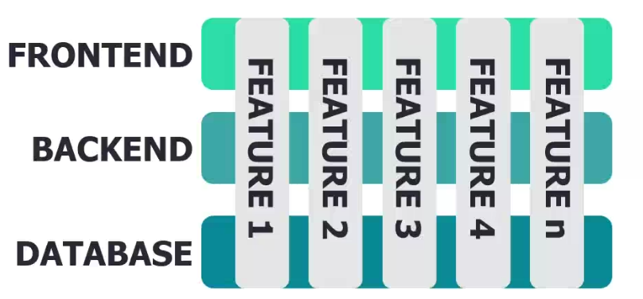

# Zarządzanie Projektami

Mail Marcina Gomoły - u.m.gomola@gmail.com

1. Podstawowe narzędzia, Diagram Grantta, Od pomysłu do realizacji, Cykl życia projektu, Vertical vs Horizontal slice
2. Waterfall, Agile i Lean, Ogólnie o metodologiach zwinnych, SCRUM, KANBAN, XP, Organizacja projektu w metodologii SCRUM, Ceremowanie SCRUM, Estymacje
3. Struktura zespołu IT, Pozyskiwanie Funduszy, Projektowanie MS (Milestone) Planu, Zarządzanie rynkiem, Konferencje
4. Zaliczenie

#### Projekt

- Pomysł na innowacyjną aplikację(dowolną) lub grę komputerową w postaci 1-pagera zawierającego:
    - Informacje o obecnym zespole
    - Krtótkim podsumowaniu projektu i jego USP
    - Informacje o Targecie projektu
    - Informacje o modelu biznesowym
    - Zagrożeniach i konkurencji

- Wysokopoziomowy plan projektu w oparciu o diagram Grantta, zawierający informacje o fazach proejektu / milestonach

- Przykładowy niskopoziomowy Backlog projektu, przypadający na środkowy etap produkcji wraz z opisami: stories, taskami, informacjami o działach, estymacjami w Story Point'ach, priorytetach
- W oparciu o backlog oraz założone wcześniej velocity poszczególnychg działów zaplanowanie jednego 2-tygodniowego sprintu

#### Egzamin

Pisemny egzamin końcowy - Warunkiem zaliczenia modułu jest uzyskanie oceny pozytywnej z egzaminu. Zakres materiału obejmuje zagadnienia z wykładu (teoria).

## Wykład 1

Zarządzanie projektami to proces planowania, realizacji i nadzorowania działań, które prowadzą do osiągnięcia określonych celów. __W praktyce__ - Chaos, ogień i This is Fine.

Wykres Granta

1. Wykres Grantta to narzędzie do wizualnego planowania i zarządzania projektami, któe przedstawia zadania w dormie poziomych pasków na osi czasu. Umożliwia śledzenie postępu projektu, harmonogramu zadań oraz zależności między nimi w jednym, przejrzystym diagramie.

2. Grantt Granttowi nie równy - Zależy jak go wykorzystujemy; można próbować śledzić za jego pomocą postępy wysoko-poziomowe jak i nisko-poziomowe.
3. W praktyce bywa z nimi różnie

__Podstawy projektowe - pierwsze kroki:__
-   Pomysł
-   USP (Unique selling proposition) - element albo jeszcze lepiej szereg elementów unikalnych - w naszym przypadku - na tle aplikacji konkurencyjnych dostępnych na rynku.
-   Analiza Rynku
    -   Research Targetu - Dla kogo jest ten produkt?
    -   Research Konkurencji - Analiza tytułów pokrewnych
    -   Draft GDO/ 1-Pager - Krótki dokument zawierający podstawowe informacje o produkcie
    -   Draft MS Planu - Opracowanie wstępnego MS planu i strategii produkcji; ile potrzeba czasu, jak projekt będzie tworzony, a może: Early Access?
    -   Draft Staffing Planu - Kto faktycznie będzie ten projekt robił
    -   Iteracja!
-   Planowanie
-   Pitchowanie - Krótka, zwięzła prezentacja pomysłu lub projektu, która trwa zwykle 15-30 min. Ma na celu szybko i skutecznie zaiteresować odbiorcę oraz przekazać kluczowe informacje o projekcie. A jeśli się nie uda? Kosz i Iteracja.

__Mamy Fundusze, co dalej?__ - Cykl życia projektu

-   Pre-produckja - Od startu projektu skupiamy się na budowie prototypu: sprawdzeniu koncepcji, zwykle w małym, doświadczonym zespole
-   Produkcja - Po Verticalu zwykle następuje rozwój zespołu i zaczyna się pełna produkcja nad featurami
-   Praca w Alfie - W teorii mamy już podwaliny projektu, natomiast praca wcale nie zamiera
-   Praca w Becie - Powinniśmy być skupieni na debugu i optymalizacji projektu, w praktyce zależy
-   Końcówka - Kluczowy moment w cyklu życia projektu. Przygotowanie do releasu

__Kluczowe Milesotny__
1. PoC - Pierwszy prototyp, zawierający kluczowe mechaniki, bardzo często barcdziej 'mock-up'y'
2. First Playable - Już więcej niż PoC, ale jeszcze nie Vertical Slice
3. Vertical Slice - "Demo" na potrzeby produkcji, wewnętrzny prototyp o niepełnej funkcjonalności ale prezentujący docelową wizję i jakość
4. Alpha - Pierwsza kompletna wersja produkcji
5. Beta - Kompletna wersja produktu, tylko usuwanie błędów
6. Gold Master - Opracowanie 

__Vertical Slice vs Horizontal Slice__

Vertical - 

Horizontal - Jeden Feature na jeden End-line